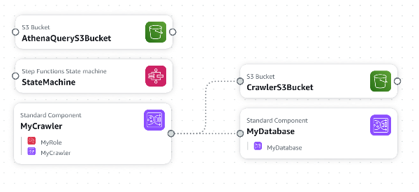
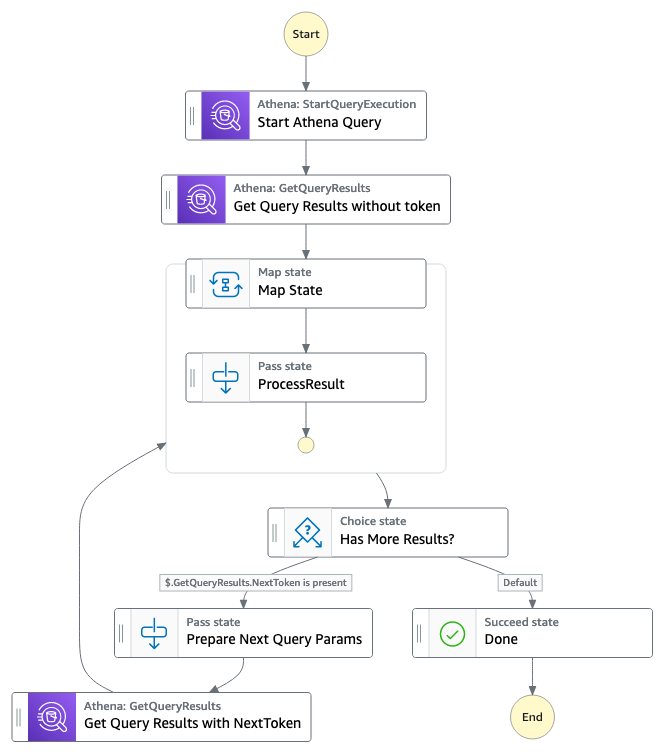
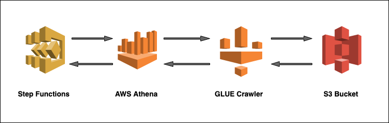
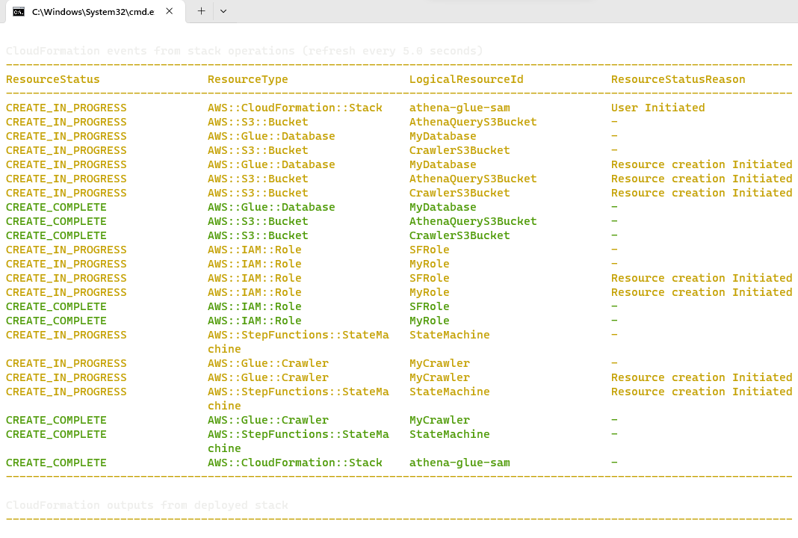
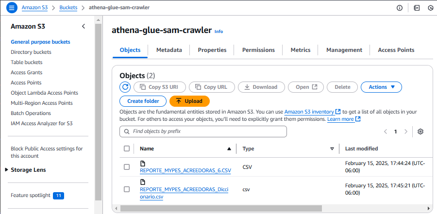
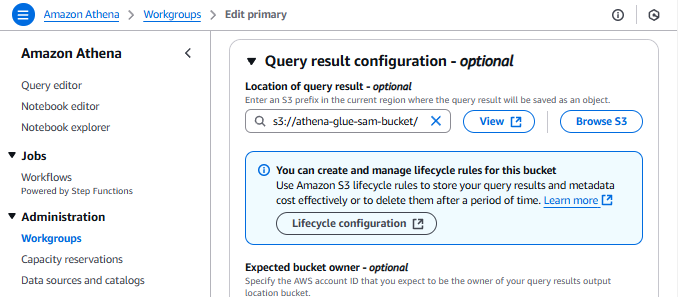
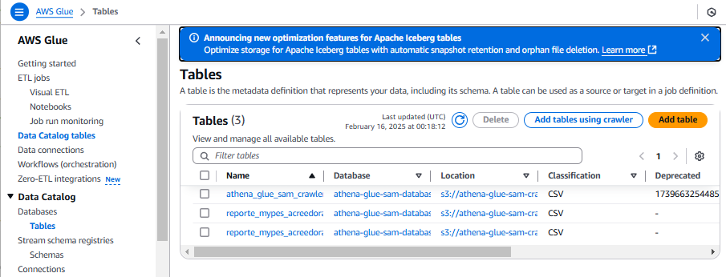
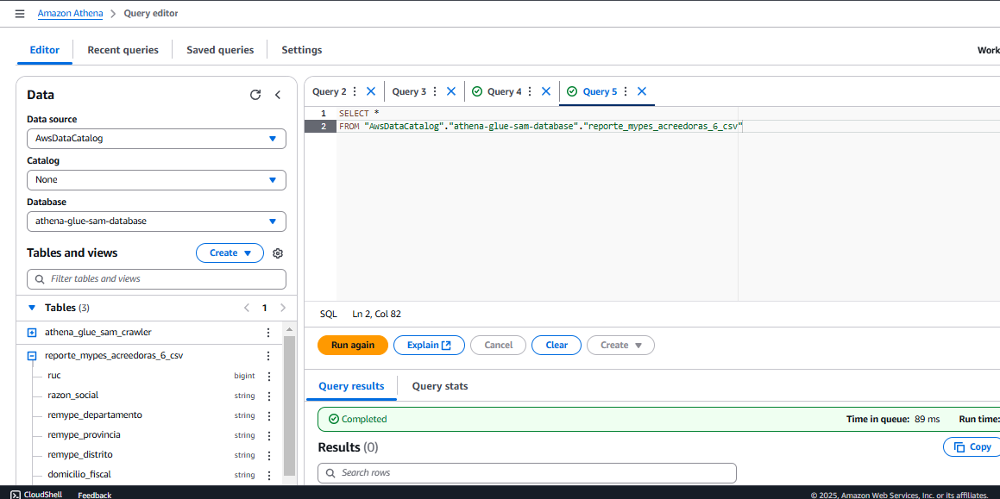

# Serverless que procesa data S3 data con Athena. 





Este patrón serverless utiliza AWS Athena y permite analizar datos en Amazon S3 mediante SQL estándar. Un Glue crawler crea una tabla de base de datos a partir de los datos de S3 que es consultada por Athena.

Athena se integra de forma inmediata con AWS Glue Data Catalog, lo que le permite crear un repositorio de metadatos unificado en varios servicios, rastrear orígenes de datos para detectar esquemas y rellenar su Catalog con definiciones de tablas y particiones nuevas y modificadas, y mantener el control de versiones del esquema. Para usarlo simplemente se tiene que apuntar a su data S3, definir el esquema y comenzar a realizar consultas mediante SQL estándar. La mayoría de los resultados se entregan en cuestión de segundos.

## Casos de uso
Este patrón de aplicación se puede utilizar para consultar, analizar y procesar cualquier tipo de datos almacenados en S3. Por ejemplo, los datos pueden ser una lista de resultados de películas, registros de cloudtrail, registros de vpc, lista de inventario, etc.

## Costos
Importante: esta aplicación utiliza varios servicios de AWS y hay costos asociados con estos servicios después del uso de la capa gratuita - se puede consultar [AWS Pricing page](https://aws.amazon.com/pricing/) para conocer los costos con mayor detalle. Usted es responsable de los costos de AWS en los que se incurra. No hay ninguna garantía implícita en este ejemplo.

## Requisitos

* [Create an AWS account](https://portal.aws.amazon.com/gp/aws/developer/registration/index.html) Si aún no lo tiene, créelos e inicie sesión. El usuario de IAM que utilice debe tener permisos suficientes para realizar las llamadas de servicio de AWS necesarias y administrar los recursos de AWS.
* [AWS CLI](https://docs.aws.amazon.com/cli/latest/userguide/install-cliv2.html) debe estar instalado y configurado
* [Git Installed](https://git-scm.com/book/en/v2/Getting-Started-Installing-Git)
* [AWS Serverless Application Model](https://docs.aws.amazon.com/serverless-application-model/latest/developerguide/serverless-sam-cli-install.html) (AWS SAM) instalado
* [Python Installed].
* [AWS RedShift Serverless]. debe estar instalado y configurado 

## Instructiones del despliegue

1. Crear un nuevo directorio, navegar a este directorio en un terminal y clonar el repositorio GitHub:
    ``` 
    git clone https://github.com/arquitectopaul/aws_data_engineering_athena_glue.git
    ```
1. Desde la línea de comandos, utilizar AWS SAM para desplegar los recursos especificados en el archivo template.yml :
    ```
    sam deploy --guided
    ```


1. Durante las indicaciones:
    * Ingrese un nombre para su nuevo stack 
    * Ingrese la Region AWS
    * Permitir SAM CLI crear los roles IAM con los permisos necesarios.

Una vez que haya ejecutado sam deploy -guided mode una vez y haya guardado los argumentos en un archivo de configuración (samconfig.toml), puede usar sam deploy en el futuro para usar estos valores predeterminados.

## Testing

1. Ir al bucket S3 y cargar la data csv. En ese caso hemos cargado cualquier data encontrada en https://datosabiertos.gob.pe/


1. Ir a la consola AWS Glue Crawler y correr el reciente Crawler creado. Esto escaneará la data del bucket S3 bucket data y automáticamente creará las tablas.





2. Observar los logs de la ejecución del step function execution para verificar si todos los resultados fueron procesados.



## Cleanup

 1. Para eliminar el stack ingresar desde SAM CLI -
    ```
    sam delete
    ```

